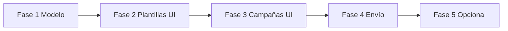

# Plan: plantillas dinámicas y variables de contenido

Rama: `feature/template-variable-schema`

Objetivo: que cada plantilla Twilio declare qué variables (`{{1}}`, `{{2}}`, …) necesita, para que registro, campañas y envío pidan y rellenen solo lo correspondiente (imagen + saludo, microcurso + enlace, etc.).

## Contexto actual

- `buildContentVariablesForEmployee` asume siempre `{{1}}` = nombre del empleado y `{{2}}` = media.
- `TemplateForm` y `CampaignForm` están acoplados a plantillas con imagen.
- `Campaign.contentVariables` existe en BD pero no se persiste ni se usa al enviar.

## Estado de implementación

- [x] Fase 1 — Modelo y tipos
- [x] Fase 2 — Registro y edición de plantillas
- [x] Fase 3 — Campañas (UI y persistencia)
- [x] Fase 4 — Envío y builder de variables
- [x] Fase 5 — Pulido y extensión (opcional)

## Fase 1 — Modelo y tipos

**Entregables**

- Campo en `Template` para el esquema (p. ej. `variableSchema` JSON string o tipo Prisma `Json`).
- Tipos TypeScript compartidos: `TemplateVariableDef` con `key`, `label`, `kind` (`static` | `employee` | `media`), `input` (`text` | `url` | …), `required`, opciones `source` / `defaultFrom`.
- Presets opcionales (`image_greeting`, `course_link`) para precargar esquemas al registrar plantilla.
- Migración Prisma + validación al crear/actualizar plantilla (JSON válido, claves numéricas únicas).

**Criterio de done**

- Plantillas existentes migradas con preset `image_greeting` equivalente al comportamiento actual.
- Tests unitarios de parse/validate del esquema (si hay suite de tests; si no, funciones puras documentadas).

## Fase 2 — Registro y edición de plantillas

**Entregables**

- `TemplateForm`: selector de preset + editor de variables (o JSON avanzado).
- Mostrar `mediaBaseUrl` / `mediaFileName` solo si el esquema incluye variable `kind: media`.
- Detalle de plantilla (`/plantillas/[id]`): listado legible de variables configuradas.
- `lib/actions/templates.ts`: guardar y validar `variableSchema`.

**Criterio de done**

- Se puede registrar la plantilla de microcurso (curso + enlace) sin campos de media obligatorios.
- La plantilla de imagen sigue funcionando con el preset migrado.

## Fase 3 — Campañas (UI y persistencia)

**Entregables**

- `CampaignForm`: al cambiar plantilla, renderizar inputs solo para variables `kind: static`.
- Subida de archivo solo si hay variable `kind: media`.
- Texto de ayuda dinámico (sin asumir siempre `{{1}}`/`{{2}}`).
- `parseCampaignForm`: serializar valores estáticos en `Campaign.contentVariables`.
- Pasar `variableSchema` desde servidor en `app/campanas/nueva/page.tsx`.

**Criterio de done**

- Crear campaña con plantilla de curso guarda nombre del curso y URL en `contentVariables`.
- Crear campaña con plantilla de imagen se comporta como hoy (media + nombre automático).

## Fase 4 — Envío y builder de variables

**Entregables**

- Refactor de `lib/messaging/content-variables.ts`: `buildContentVariables(templateSchema, campaignStaticVars, employee, mediaContext)`.
- `launchCampaign` y `sendIndividualMessage` usan esquema de la plantilla + `campaign.contentVariables` + empleado/media.
- Validación antes de Twilio: variables requeridas presentes; mensajes de error claros.

**Criterio de done**

- Envío de prueba OK para ambos tipos de plantilla (sandbox/producción según entorno).
- Variables guardadas en `Message.contentVariables` reflejan lo enviado a Twilio.

## Fase 5 — Pulido y extensión (opcional)

**Entregables**

- Sincronización opcional con Twilio Content API al registrar `contentSid` (sugerir esquema).
- Envío individual: formulario o API que acepte overrides de variables estáticas.
- Documentación breve en README o en esta carpeta `docs/`.

**Criterio de done**

- Flujo documentado para añadir una plantilla nueva sin tocar código (solo registro + esquema).

## Orden de implementación

## Riesgos y notas

- Los índices `{{n}}` los define cada Content Template en Twilio; el esquema en app debe coincidir con la plantilla aprobada.
- Plantilla de curso: `{{2}}` suele ser URL completa en el cuerpo, no path de media concatenado con CDN.
- No mezclar semántica global de variables entre plantillas distintas.

## Checklist de regresión

- [ ] Campaña borrador → lanzar → mensajes `sent`/`failed` como antes.
- [ ] Vista detalle campaña muestra `contentVariables` correctos.
- [ ] Plantillas globales y por empresa siguen filtrándose en campaña.
